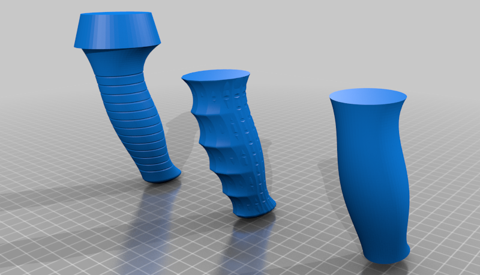
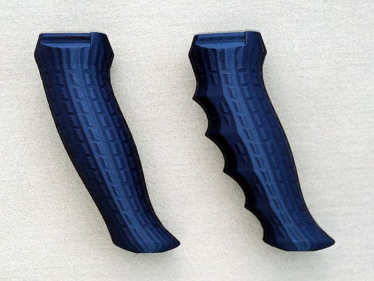
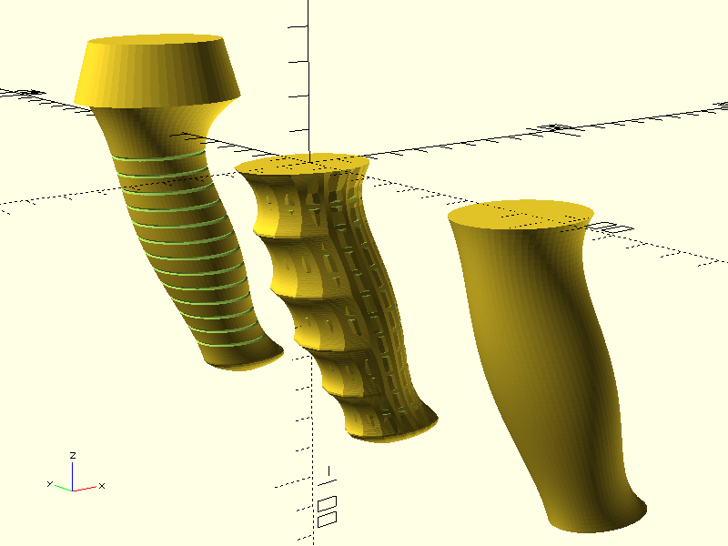
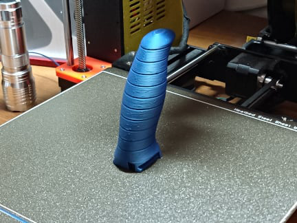
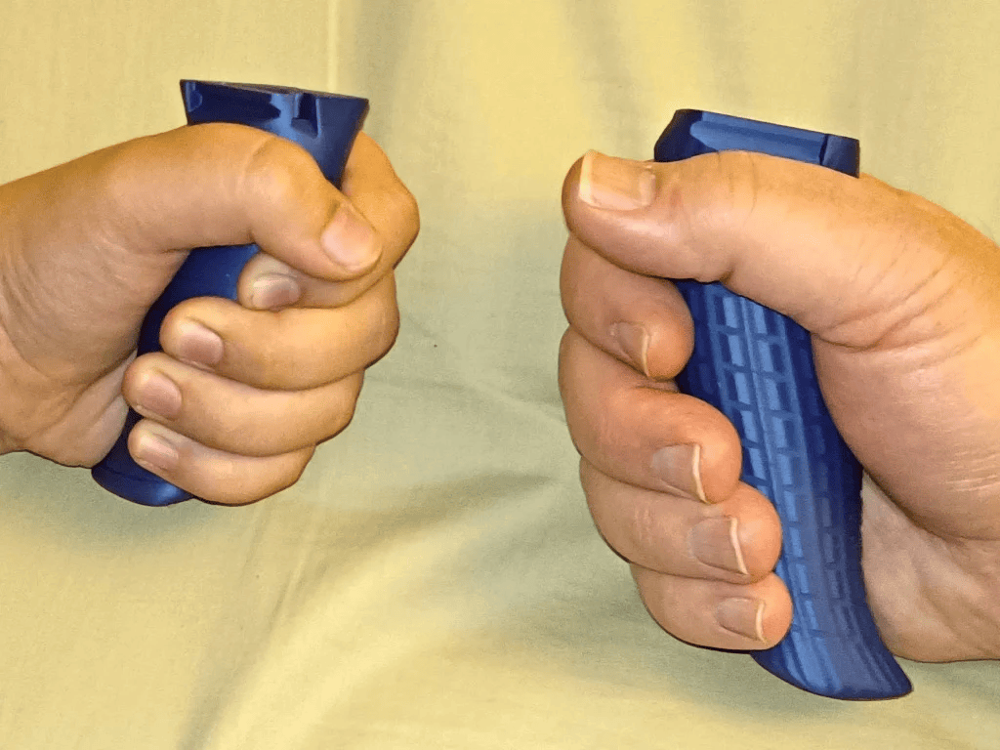

# Ergonomic Handle

This is an OpenSCAD library to generate an ergonomic handle that distributes hand contact pressure as evenly as possible.



## Summary

The Ergonomic Handle Library is an OpenSCAD library designed to generate ergonomic handles that distribute hand contact pressure as evenly as possible. This library leverages anthropometric data from various populations worldwide to create handles that are both comfortable and scalable to different hand sizes.



## Features

- **Scientific Design**: Based on multiple research studies using anthropometric data.
- **Scalable**: Handles can be adjusted to fit any hand size by specifying hand length and width.
- **Customizable**: Various parameters allow for modifications such as finger grooves and handle extensions.
- **Ergonomic**: Designed to distribute pressure evenly across the hand, reducing strain during use.
- **Open Source**: Licensed under Creative Commons - Attribution, allowing for modification and sharing.

## Usage

To use the Ergonomic Handle Library in your OpenSCAD project, follow these steps:

1. **Download the Library**: Ensure you have the `ergonomic_handle.scad` file.
2. **Include the Library**: Place the library file in a searchable location, such as the same directory as your script.
3. **Import the Library**: Add the following line near the top of your OpenSCAD script:
```use <ergonomic_handle.scad>```
4. **Generate the Handle**: Utilize the `ergonomic_handle` module with your desired parameters.

## Modules and Parameters

### `ergonomic_handle`

Renders the body of an ergonomic handle, centered at the origin.



**Parameters:**

- `hand_length` (default: 186): Length of the hand from the tip of the middle finger to the first crease on the wrist, in millimeters.
- `hand_width` (default: 85): Metacarpal breadth; width of the four fingers where they meet the palm, in millimeters.
- `flair` (default: true): Flare out the top and bottom of the front edge for better pull force.
- `bottomcapext` (default: 0): Bottom cap extension. Suggested values: 3 to 8.
- `topext` (default: 0): Top extension, curves extrapolated upward by this amount.
- `groovespc` (default: 0): Groove spacing for improved grip. Suggested spacing: 6-10 mm.
- `fingergroove` (default: false): Enables finger-specific grooves. **Note:** May reduce ergonomic comfort for other hand sizes.
- `tiltangle` (default: 110): Handle tilt angle in degrees. Should be no less than 90.
- `fn` (default: 64): Number of facets in the elliptical cross-section and vertical slices.
- `halfrotate` (default: false): Rotates polygon vertices half of a segment around the ellipse.
- `metacarpal_expansion` (default: 1.12): Expands metacarpal breadth in gripping position. **Range:** 1.10–1.15.
- `groovedepth` (default: 0.6): Depth of grooves, used for creating textured grip.
- `bottomcapscale` (default: 0.3): Scale factor for the bottom-most disc of the handle's base cap.

### Supporting Modules

- **`ergonomic_handle_top_ellipse`**: Returns a polygon corresponding to the top surface of the handle, including any extensions.
- **`ergonomic_handle_bottom_ellipse`**: Returns a polygon corresponding to the bottom surface of the handle, excluding any bottom cap extensions.
- **`ergonomic_handle_height`**: Calculates the height of the basic handle body without extensions based on hand width.

## Print Settings



When 3D printing the ergonomic handle, consider the following settings:

- **Printer Brand**: Compatible with Prusa I3 MK3S.
- **Supports**: Not required if printed upside-down. Supports may be needed if printed right-side-up.
- **Infill**: 15% gyroid for optimal strength and material usage.
- **Orientation**: Print the handle upside-down to avoid the need for supports and ensure structural integrity.

**Notes:**

- The handle should be printed upside-down to minimize the need for supports.
- Incorporate a top structure with sliding rails for additional parts to snap into place.

## License

This library is licensed under the Creative Commons - Attribution license (CC BY). You are free to share and adapt the material provided you give appropriate credit.

## Attribution

This project is based on the work of **Alex Matulich**, originally posted on [Thingiverse](https://www.thingiverse.com/thing:5330170) and detailed on his [blog](https://www.nablu.com/2022/03/whose-hands-are-biggest-you-may-be.html). All studies and data used in this library are cited and linked in the original blog article "Whose hands are biggest? You may be surprised."



For more designs and information, visit Alex's [Thingiverse page](https://www.thingiverse.com/thing:5330170) or his [blog](https://www.nablu.com/2022/03/whose-hands-are-biggest-you-may-be.html).

## Where to Find This Design

The OpenSCAD model for this ergonomic handle is available on [Thingiverse](https://www.thingiverse.com/thing:5330170) and [Printables](https://www.printables.com/model/154837).

---
